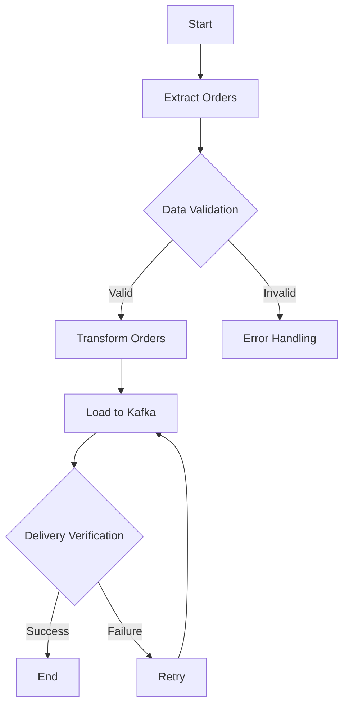

# Sipariş İşleme Otomasyonu - Airflow Çözümü

## Soru : Bu süreci günlük olarak otomatikleştirmenizi istesek, bir araç öneriniz ne olurdu? Bu soru için bir Java uygulaması yazmanız gerekmez. Herhangi bir dil, çerçeve ve araç kullanabilirsiniz. Lütfen nedenleriyle birlikte açıklayın. (Bu soru için kodlama gerekmiyor, sadece bir akış önerisi istiyoruz)

Bu problem aslında günlük olarak teslim edilen siparişleri filtreleme yapıp bunları DeliveredOrder objesine dönüştürüp order_delivery_statistics topic gönderen bir uygulamadır.Biz bu programı otomatize edebiliriz.
Airflow, karmaşık veri işleme süreçlerini otomatize etmek için ideal bir araçtır. Görsel workflow yönetimi, merkezi monitoring ve otomatik retry mekanizması gibi özellikleriyle, sipariş işleme sürecini güvenilir ve ölçeklenebilir bir şekilde yönetmemizi sağlar. Biz bu java application özelinde yapılan işlemleri airflow kullanarak otomatik olacak şekilde yapabiliriz.

## Airflow Nedir?

Airflow, karmaşık veri işleme süreçlerini otomatize etmek için geliştirilmiş açık kaynaklı bir platformdur. Görsel arayüzü, hazır operatörleri ve güçlü monitoring özellikleriyle, veri pipeline'larını etkili bir şekilde yönetmemizi sağlar.

## Neden Airflow?

### 1. DAG (Directed Acyclic Graph) Yapısı
- Görevlerin bağımlılıklarını ve çalışma sırasını belirler.
- Bizim senaryomuz için örnek akış:
  ```
  Extract Orders -> Transform Orders -> Load to Kafka
  ```
- Başarısız görevlerde bağımlı görevler otomatik durdurulur.
- Paralel çalışabilecek görevler otomatik tespit edilir.

### 2. Zamanlanmış Görevler(Cron Job)
- Cron benzeri ifadelerle esnek zamanlama sayesinde görevleri otomotize edebiliriz.
- Örnek zamanlamalar:
  ```python
  # Her gün gece yarısı çalıştır
  schedule_interval='0 0 * * *'
  
  # Her Pazartesi sabah 8'de çalıştır
  schedule_interval='0 8 * * 1'
  ```

### 3. Otomatik Retry Mekanizması
- Başarısız görevler için otomatik yeniden deneme mekanizmasına sahiptir.(Retry Pattern)
- Örnek konfigürasyon:
  ```python
  retries = 3                    # Toplam 3 deneme
  retry_delay = timedelta(minutes=5)  # 5 dakika bekle
  ```
- Maksimum deneme sayısına ulaşıldığında alert tetiklenir.Bu şekilde bildirim alarak probleme müdahale edebiliriz.

### 4. Detaylı Monitoring ve Loglama
- Web UI üzerinden gerçek zamanlı izleme:
  - Görev durumları ve çalışma süreleri
  - Hata mesajları ve stack trace'ler
  - Resource kullanımı ve performans metrikleri
- Uzun süreli log saklama ve arama
- Özelleştirilebilir dashboard'lar

### 5. Bildirim Sistemi
- Çoklu bildirim kanalları:
  ```python
  # E-posta bildirimleri
  email_on_failure = True
  email_on_retry = True
  
  # Slack entegrasyonu
  slack_webhook_conn_id = 'slack_default'
  ```
- Farklı durumlar için özelleştirilebilir bildirimler:
  - Başarısızlık durumunda
  - Retry durumunda
  - Başarılı tamamlanma durumunda
- Ekip bazlı bildirim yönetimi

## Bizim Senaryo İçin Avantajları

Otomatik hata yönetimine sahip olması, Veri Bütünlüğü garantisi,Sürekli Monitoring yapması güvenirlik konusunda bize destek sağlar.
Günlük otomatik çalışma,paralel işlem desteği(paralel tasks) ve Resource optimizasyonu (CPU kullanım) bize Verimlilik konusunda destek sağlar.
Detaylı loglar,performans metrikleri ve Hata Takibi sayesinde Monitoring kısmında uygulamanın sağlıklı çalıştığını izleme noktasında destek sağlar.
Anlık Bildirimler,Kolay Debug İmkanı ve Hızlı recovery sayesinde biz genel program'da oluşan problemlere müdahale edebiliriz bu şekilde sistem daha yüksek erişebilirlik sağlar.

Bu özellikler, sipariş işleme sürecimiz için ideal çünkü:
- Günlük çalışan bir süreç
- Veri bütünlüğü kritik
- Hata durumunda hızlı müdahale gerekli
- Süreç performansının izlenmesi önemli

## Workflow



## Workflow Akışı

Extract (Veri Çekme) adımında, MySQL veritabanından belirli bir tarih aralığındaki teslim edilmiş siparişler çekilir. Veriler, doğruluk ve bütünlük kontrollerinden geçirilir.

Transform (Veri Dönüştürme) adımında, geçerli siparişler için teslimat süreleri hesaplanır. ETA ve gerçek teslimat süreleri karşılaştırılır, veriler temizlenir ve Kafka'ya uygun formata dönüştürülür.

Load (Veri Yükleme) adımında, işlenmiş veriler Kafka'ya gönderilir. Gönderim başarısı doğrulanır. Hata durumunda, sistem 3 kez 5'er dakika(tamamen farazi) aralıklarla yeniden deneme yapar.