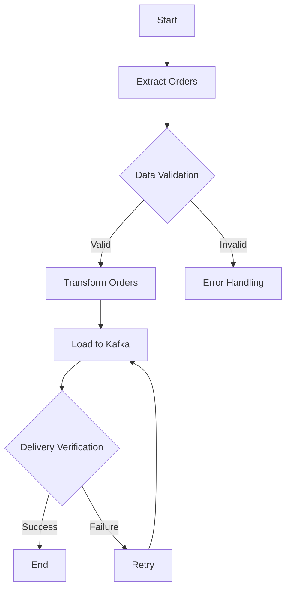

# Sipariş İşleme Otomasyonu - Airflow Çözümü

Bu proje, teslim edilmiş siparişleri günlük olarak işleyen ve Kafka'ya gönderen bir Airflow DAG'ıdır. Airflow, karmaşık veri işleme süreçlerini otomatize etmek için ideal bir araçtır. Görsel workflow yönetimi, merkezi monitoring ve otomatik retry mekanizması gibi özellikleriyle, sipariş işleme sürecini güvenilir ve ölçeklenebilir bir şekilde yönetmemizi sağlar. Biz bu java application özelinde yapılan işlemleri airflow kullanarak otomatik olacak şekilde yapabiliriz.

## Neden Airflow?

Airflow'u seçmemin temel nedeni, veri işleme süreçlerini yönetmek için sunduğu kapsamlı çözümlerdir. Görsel arayüzü sayesinde workflow'ları kolayca izleyebilir ve yönetebiliriz. MySQL ve Kafka için hazır operator'lar, entegrasyon sürecini basitleştirir. Ayrıca, role-based access control ve açık kaynak yapısı, güvenlik ve maliyet açısından önemli avantajlar sağlar. Bizim projemiz özelinde akışın bir Workflow yer alıyor.

## Workflow

## Workflow Akışı

Başlangıç olarak, MySQL veritabanından teslim edilmiş siparişleri çekerek başlarız. Bu adıma Extract yani Çekme adımı diyebiliriz. Belirli bir tarih aralığındaki siparişler filtrelenir ve veri doğrulama kontrollerinden geçirilir. Bu aşamada verilerin doğruluğu ve bütünlüğü kontrol edilir.

Sonraki adımda, geçerli siparişler için teslimat süreleri hesaplanır. Bu Transform yani Dönüştürme adımıdır. Burada ETA ve gerçek teslimat süreleri karşılaştırılır, veriler temizlenir ve istenen formata dönüştürülür.

Son olarak, işlenmiş veriler Kafka'ya gönderilir. Bu Load yani Yükleme adımıdır. Gönderim başarısı doğrulanır ve herhangi bir hata durumunda, sistem otomatik olarak retry mekanizmasını devreye sokar. Bu sayede veri kaybı yaşanmaz ve süreç güvenilir bir şekilde tamamlanır.