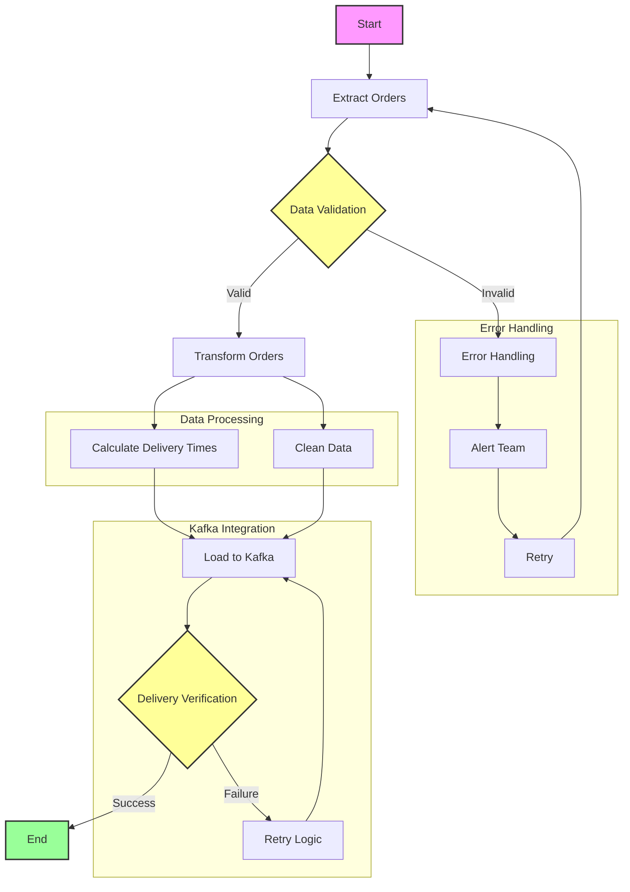

## Flow Açıklaması

1. **Başlangıç (Start)**
   - DAG'ın başlangıç noktası
   - Zamanlanmış tetikleyici (her gece yarısı)

2. **Veri Çekme (Extract Orders)**
   - MySQL'den siparişleri çeker
   - Belirli tarih aralığındaki siparişleri filtreler

3. **Veri Doğrulama (Data Validation)**
   - Veri bütünlüğü kontrolü
   - Zorunlu alanların kontrolü
   - Format kontrolü

4. **Veri İşleme (Transform Orders)**
   - Teslimat sürelerinin hesaplanması
   - Veri temizleme ve formatlama
   - İş kurallarının uygulanması

5. **Kafka'ya Gönderme (Load to Kafka)**
   - İşlenmiş verilerin Kafka'ya gönderimi
   - Partition stratejisi
   - Batch işleme

6. **Gönderim Doğrulama (Delivery Verification)**
   - Kafka'ya gönderim başarısı kontrolü
   - ACK kontrolü
   - Hata durumu yönetimi

7. **Hata Yönetimi (Error Handling)**
   - Retry mekanizması
   - Alert sistemi
   - Loglama

8. **Bitiş (End)**
   - Başarılı tamamlanma
   - Metrik toplama
   - Raporlama 